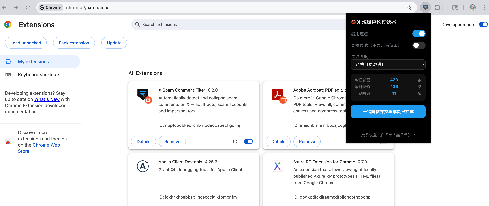

<div align="center">

[English](#english) · [中文](#chinese)

</div>

---

<a name="english"></a>

# X Spam Comment Filter

A Chrome extension that automatically detects and collapses spam comments in X (Twitter) — including adult content bots, scam accounts, and impersonators.

## Features

- **Real-time filtering**: MutationObserver scans new comments as they load and collapses matches instantly
- **Match = block**: No scoring or threshold system — any rule hit triggers immediate filtering
- **Three rule types**: Forced keywords (checked against display name, username, and text), text regex patterns, and display name regex patterns
- **Impersonation protection**: Regex skeleton matching to catch homoglyph spoofing (e.g. 硅硲居土 vs 硅谷居士)
- **Native blocking**: Calls X's internal REST API (`blocks/create.json`) directly — no UI simulation
- **Hide mode**: Remove matched comments from the DOM entirely with no placeholder shown
- **Whitelist / Blacklist**: User-managed; blacklisted accounts are removed immediately
- **Custom rules**: Add your own keywords and impersonation guards in the options page
- **Stats**: Today's count, total filtered, and manually restored

## Rule Coverage

| Category | Examples |
|----------|---------|
| Adult bots | "找搭子", "找主人", "线下dd", explicit words, sao货 templates |
| Traffic farming | link in bio, DM redirects, Telegram / Discord links |
| Financial scams | "投资策略", "内部消息", "稳赚不赔", "代操盘", pump signals |
| Impersonation | 硅谷居士/@svscholar, 陶瑞/@taoray (customizable) |
| Hard keywords | onlyfans, fansly, t.me, 约炮, 破处, 母狗, 骚妇, etc. |

## Installation

### Method 1: Chrome Web Store (Recommended)
1. Visit the [Chrome Web Store](https://chromewebstore.google.com/detail/x-spam-comment-filter/...) (link to be added).
2. Click **Add to Chrome**.

### Method 2: Developer Mode (For users in Mainland China)
If you cannot access the Chrome Web Store:
1. Download the [source code](https://github.com/frank-wang/x-comment-filter-extension/archive/refs/heads/main.zip) or clone this repository.
2. Unzip the file if downloaded as a ZIP.
3. Open Chrome and navigate to `chrome://extensions/`.
4. Enable **Developer mode** (toggle in the top right).
5. Click **Load unpacked** and select the extension folder.



## File Structure

```
manifest.json
core/
  rules.js          # Rule engine: RULES definition + scoreComment + shouldFilter
content/
  filter.js         # Main filter logic: parse → match → collapse/remove
  parser.js         # Extracts displayName/username/text from article DOM
  observer.js       # MutationObserver + SPA route change detection
  actions.js        # Block API calls, block-all button
  styles.css        # Collapsed placeholder styles
shared/
  storage.js        # chrome.storage.local wrapper
popup/
  popup.html/js     # Popup: enable toggle, hide mode, stats, block-all
options/
  options.html/js   # Settings: whitelist, blacklist, custom keywords, impersonation rules
tests/
  rules.test.js     # Rule engine unit tests (node tests/rules.test.js)
```

## Tests

```bash
node tests/rules.test.js
```

## Docs

- [Product Spec](./docs/x-comment-filter-extension-prd.md)
- [Bot Patterns](./docs/bot-patterns.md)
- [Privacy Policy](./PRIVACY.md)

---

<a name="chinese"></a>

# X 垃圾评论过滤器

Chrome 插件，自动识别并折叠 X（Twitter）评论区中的黄推引流、色情导流、仿冒账号及割韭菜账号。

## 功能

- **自动过滤**：MutationObserver 实时扫描新评论，命中规则立即折叠
- **命中即屏蔽**：无积分/阈值系统，规则匹配直接生效
- **三类规则**：强制关键词（昵称/用户名/正文任一含）、正文正则、昵称正则
- **仿冒保护**：正则骨架匹配，防止同形字绕过（如硅硲居土 vs 硅谷居士）
- **真实 Block**：调用 X 内部 REST API（`blocks/create.json`），无需模拟点击
- **直接隐藏模式**：不显示折叠占位条，直接从 DOM 移除
- **白名单 / 黑名单**：用户自定义，黑名单账号直接移除
- **自定义规则**：在设置页添加自定义关键词和仿冒保护规则
- **统计**：今日/累计过滤数、手动恢复数

## 规则覆盖范围

| 类型 | 说明 |
|------|------|
| 黄推引流 | 找搭子、找主人、线下dd、色情词、sao货等模板文案 |
| 色情导流 | link in bio、私信联系、主页自取、TG/Discord 外链 |
| 割韭菜 | 投资策略、内部消息、喊单、稳赚不赔、代操盘等 |
| 仿冒账号 | 硅谷居士/@svscholar、陶瑞/@taoray（可自定义添加）|
| 强制关键词 | onlyfans、fansly、t.me、约炮、破处、母狗、骚妇等 |

## 安装方法

### 方法一：Chrome 网上应用店（推荐）
1. 访问 [Chrome Web Store](https://chromewebstore.google.com/detail/x-spam-comment-filter/...) (链接待更新)。
2. 点击 **添加至 Chrome**。

### 方法二：开发者模式（适合中国大陆用户）
如果你无法访问 Chrome 应用店：
1. 下载 [源代码 ZIP 包](https://github.com/frank-wang/x-comment-filter-extension/archive/refs/heads/main.zip) 或克隆本仓库。
2. 如果是 ZIP 包，请先解压。
3. 打开 Chrome 浏览器，在地址栏输入 `chrome://extensions/` 并回车。
4. 在右上角开启 **开发者模式**。
5. 点击左上角的 **加载已解压的扩展程序**，选择本项目的根目录。


## 文件结构

```
manifest.json
core/
  rules.js          # 规则引擎：RULES 定义 + scoreComment + shouldFilter
content/
  filter.js         # 过滤主逻辑：解析 → 匹配 → 折叠/移除
  parser.js         # 从 article DOM 提取 displayName/username/text
  observer.js       # MutationObserver + 路由变更监听
  actions.js        # Block API 调用、一键拉黑
  styles.css        # 折叠占位条样式
shared/
  storage.js        # chrome.storage.local 封装
popup/
  popup.html/js     # 弹出面板：启用开关、直接隐藏、统计、一键拉黑
options/
  options.html/js   # 设置页：白名单、黑名单、自定义关键词、仿冒保护
tests/
  rules.test.js     # 规则引擎单元测试（node tests/rules.test.js）
```

## 测试

```bash
node tests/rules.test.js
```

## 文档

- [需求说明](./docs/x-comment-filter-extension-prd.md)
- [黄推机器人画像](./docs/bot-patterns.md)
- [隐私政策](./PRIVACY.md)
